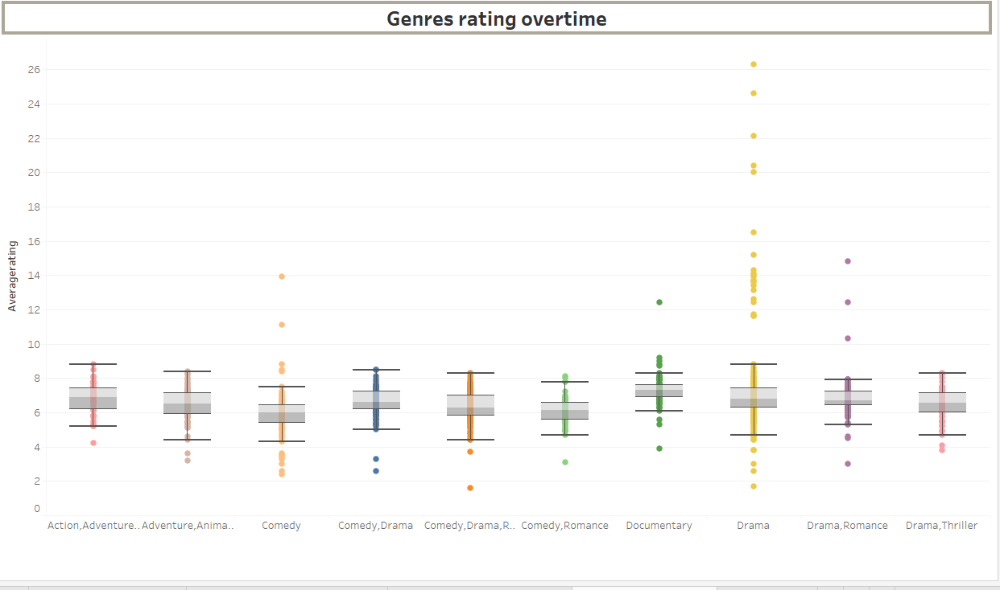

# Phase-2-project---Movie-Analysis

## Movie Studio Insights Project

### Introduction

Welcome to the Movie Studio Insights Project! This project aims to provide a comprehensive analysis of current box office trends to guide the strategic decisions for our new movie studio. By leveraging data from multiple sources, I aim to identify the types of films that are currently performing best at the box office and translate these findings into actionable insights.

### Objectives

1. Identify the Highest Grossing Films: Determine which movies are leading in box office earnings.
2. Determine the Most Common Genres Among Top-Grossing Movies: Analyze the prevalent genres among the highest-grossing films.
3. Analyze the Correlation Between Box Office Performance and Movie Ratings: Investigate how movie ratings correlate with their box office success.
4. Identify the Most Successful Film Studios: Recognize the studios that produce the most successful films.

#### Datasets Used

* im.db.zip: Zipped SQLite database containing movie_basics and movie_ratings tables.
* bom.movie_gross.csv.gz: Compressed CSV file with box office gross information.

### Project Steps

1. Data Extraction and Cleaning

* SQLite Database:
Extracted  cleaned data from movie_basics and movie_ratings tables.
Dropped rows with null values in crucial columns like original_title and genres.
Merged the tables on the movie_id column.
* CSV File:
Loaded and cleaned bom.movie_gross.csv.gz.
Removed commas and converted the foreign_gross column to numeric.
Filled missing values in foreign_gross with the median of the column.

2. Data Merging

Merged the cleaned data from the SQLite database with the cleaned CSV data using the title and year columns.

3. Feature Engineering
Created new columns like total_gross by summing domestic_gross and foreign_gross.
Condensed filters using parameters for a more user-friendly dashboard experience.

  
   

4. Visualization and Analysis
Generated key visualizations to meet project objectives:
Bar charts and line graphs to identify highest-grossing films.

5. Dashboard Creation
Created an interactive dashboard in Tableau, including:
Key Performance Indicators (KPIs).

Dynamic filters using parameters.
Interactive visualizations to explore data insights.

Dashboard Title

Strategic Insights for Our New Movie Studio

6. Dashboard Snapshot

* Highest Grossing Films: Identify the top-performing movies at the box office.
  
* Popular Genres: Uncover the most common genres among high-grossing films.
  
* Performance and Ratings Correlation: Analyze how box office success aligns with movie ratings.
  
* Leading Film Studios: Recognize the studios behind the most successful films.
  

This project provides a solid foundation for understanding the current trends in the movie industry. By leveraging the insights gained from this analysis, our new movie studio can make informed decisions to produce content that resonates with audiences and achieves box office success.

### RECOMMENDATIONS

* Prioritize production in high-performing genres such as Action, Adventure, and Animation. These genres have shown strong box office returns and audience appeal.
* Establish partnerships or collaborations with successful studios identified in the analysis. This can help leverage their expertise and increase the likelihood of box office success.
* Focus on creating high-quality content that receives positive ratings from critics and audiences. Investing in strong scripts, talented directors, and high production values can help achieve this

### Contact

For any questions or further information, please contact [Kellie Njoki Ndaru] at [kelliemenyl@gmail.com].